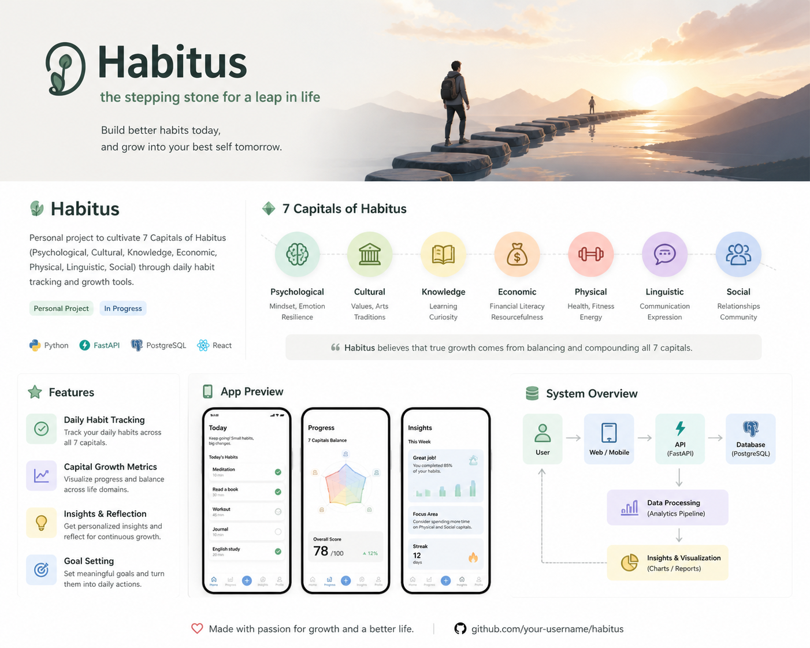

<div align="center">



<br/>

[](https://openjdk.org/)
[](https://spring.io/projects/spring-boot)
[](https://spring.io/projects/spring-data-jpa)
[](https://gradle.org/)
[]()

<br/>

**Habitus** is a personal growth platform that helps you cultivate 7 key life capitals through daily habit tracking, activity history, and intelligent recommendations.

[Demo](https://habitus-demo.lovable.app) · [Technical Decisions](#technical-decisions) · [API Reference](#api-reference)

</div>

---

## Why Habitus?

Most habit trackers just check boxes. Habitus thinks differently — every action you take compounds across **7 dimensions of your life**. A morning run isn't just exercise; it builds physical capital *and* mental capital. Reading a book grows knowledge *and* linguistic capital.

Habitus quantifies that compounding effect and tells you where to invest your time next.

---

## 7 Capitals

<div align="center">

| 🧠 Psychological | 🏛 Cultural | 📚 Knowledge | 💰 Economic | 💪 Physical | 🗣 Linguistic | 🤝 Social |
|:---:|:---:|:---:|:---:|:---:|:---:|:---:|
| Mindset, Resilience | Values, Arts | Learning, Curiosity | Financial Literacy | Health, Fitness | Communication | Relationships |

> *True growth comes from balancing and compounding all 7 capitals.*

</div>

---

## Features

**Activity Templates** — Define reusable activities with capital effect scores. A 30-min workout might give +10 Physical, +3 Mental.

**Activity History** — Log every time you perform an activity. Track when, how long, and how it felt.

**Smart Recommendations** — Given your available time and capital priorities, Habitus finds the optimal activity combination using a dynamic programming algorithm.

---

## Tech Stack

```
Spring Boot 3.5.9   Java 21   Spring Data JPA   H2 / MySQL   Gradle   Lombok
```

Architecture follows **Clean Architecture** — domain logic is framework-free, dependencies point inward.

```
Presentation  →  Application  →  Domain  ←  Infrastructure
```

---

## API Reference

<details>
<summary><b>Activity Templates</b> — /api/activities</summary>

| Method | Endpoint | Description |
|--------|----------|-------------|
| `GET` | `/api/activities` | List all activities |
| `GET` | `/api/activities/{id}` | Get activity |
| `POST` | `/api/activities` | Create activity |
| `PUT` | `/api/activities/{id}` | Update activity |
| `DELETE` | `/api/activities/{id}` | Delete activity |

```json
POST /api/activities
{
  "name": "Morning Run",
  "durationMinutes": 30,
  "cost": 0,
  "effects": { "PHYSICAL": 10, "MENTAL": 5 }
}
```

</details>

<details>
<summary><b>Activity History</b> — /api/activity-histories</summary>

| Method | Endpoint | Description |
|--------|----------|-------------|
| `GET` | `/api/activity-histories?page=0&size=20` | List history (paginated, max 100) |
| `GET` | `/api/activity-histories/{id}` | Get record |
| `POST` | `/api/activity-histories` | Log activity |
| `DELETE` | `/api/activity-histories/{id}` | Delete record |

```json
POST /api/activity-histories
{
  "activityId": 1,
  "performedAt": "2024-01-15T10:30:00",
  "durationMinutes": 30,
  "notes": "Felt great today"
}
```

</details>

<details>
<summary><b>Recommendations</b> — /api/activities/recommendation</summary>

| Method | Endpoint | Description |
|--------|----------|-------------|
| `POST` | `/api/activities/recommendation` | Get optimal activity plan |

```json
POST /api/activities/recommendation
{
  "userId": 1,
  "availableMinutes": 300,
  "priorities": { "PHYSICAL": 5, "KNOWLEDGE": 4, "MENTAL": 3 }
}
```

</details>

---

## Quick Start

```bash
git clone https://github.com/Starlight258/Habitus.git
cd Habitus/classic-freighter

./gradlew bootRun      # runs on :8080 with H2 in-memory DB
./gradlew test         # run all tests
```

---

## Technical Decisions

- [Choosing the Right Algorithm for Activity Recommendations — Greedy → DP](docs/choosing-the-right-algorithm-for-activity-recommendations.md)

---

<div align="center">

Made with ❤️ for growth and a better life.

</div>
